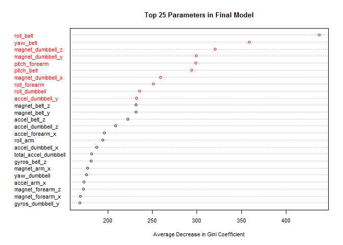

# Coursera PML Assignment
John Montgomery-Brown  
Friday, October 24, 2014  

Human Activity Recognition - Predicting The Quality of Execution
================================================================

## Synopsis
A Random Forest model was created to predict how well an individual executed 
(i.e., the quality of execution) a bicep curl using a dumbbell. The out-of-bag 
error was estimated to be 0.87% based on 10-fold cross-validation and the 
out-of-sample error rate for the validation data set was approximately 0.8%;
these results suggested that the Random Forest model was very accurate. The 
Random Forest model was applied to the test data set and all twenty predictions
generated by the model were correct (i.e., for the test data set, the model was
100% accurate).

## Introduction

While most research on human activity recognition has focused on differentiating
between various activities, little research has been conducted on determining 
how well an activity was conducted. In their 2013 paper, Velloso et al. attempted
to determine how well an individual executed a weight lifing exercise (namely, 
dumbbell curl).

For this assignment, I used data developed by Velloso et al. (2013) to develop a
model that could be used to predict the quality of execution for a dumbbell curl.
[R 3.1.1](http://www.r-project.org/) and [RStudio 0.98.1074](http://www.rstudio.com/products/RStudio/) 
were used for this analysis.

## Downloading the Data

Data for this model were obtained from the URL and file names listed in the R 
code below. These data are based on the [Weight Lifting Exercises Dataset](http://groupware.les.inf.puc-rio.br/har) of Velloso et al. (2013)
; the original data set is available [here](http://groupware.les.inf.puc-rio.br/static/WLE/WearableComputing_weight_lifting_exercises_biceps_curl_variations.csv). 

The code below was used to set up the data directory, load any required packages, 
to download the data and save it as a 'rda' file for faster loading during 
subsequent "knitting" operations.


```r
## Set up the data directory and load required packages
dir <- "./data/"
pkgs <- c("data.table", "caret", "randomForest", "e1071")
# in the code below suppressMessages was used to prevent the output from stating
# "Loading required package: x" where x is the name of a required package
suppressMessages(sapply(pkgs, function(x) { 
  if (!require(x, character.only = TRUE)) 
    {install.packages(x, repos = "http://cran.r-project.org", dependencies = TRUE)}
  require(x, character.only = TRUE)
  } ) )

## Download data if it hasn't been downloaded or if it has, load it from a saved version
# to prevent knitr from throwing an error when downloading the files, I dropped
# the 's' from https:// as suggested here:
# http://stackoverflow.com/questions/19890633/r-produces-unsupported-url-scheme-error-when-getting-data-from-https-sites
URL <- "http://d396qusza40orc.cloudfront.net/predmachlearn/" 
names <- c("pml-training.csv", "pml-testing.csv")
if (!("pml_data.rda" %in% list.files(dir))) {
  if (!file.exists(dir)) dir.create(dir)
  dateDownloaded <- sapply(names, function(x) {
    download.file(paste0(URL, x), destfile = paste0(dir, x), mode = "wb")
    date()
    } )
  
  train <- fread(paste0(dir, "pml-training.csv"))
  test <- fread(paste0(dir, "pml-testing.csv"))
  
  save(train, test, dateDownloaded, file = paste0(dir, "pml_data.rda"))
  } else {
    load(paste0(dir, "pml_data.rda"))
    }
```

## Data Processing
On examining the data, a large number of missing values were noted and a number 
of columns contained "DIV/0!" values. The entries with missing values were all
contained within the calculated summary columns (i.e., mean, variance, standard
deviation, max, min, amplitude, kurtosis, skewness) for the original data. In 
addition, "DIV/0!" values were only observed in these same columns (the "DIV/0!" 
values appear to have arisen whenever the standard deviation or variance, 
within a particular time window, were equal to zero).

Rather than working with calculated summary columns or imputing values for the 
missing and or "DIV/0!" data, I opted to remove these columns from the data set 
(if I had chosen to work with these columns, I would also have had to recalculate 
all of the summary data to ensure that an incorrect formula was not applied to 
the original data set. For example, during exploration of the data, it was noted 
that there were skewness\_roll\_belt and skewness\_roll\_belt.1 columns and that 
the skewness\_pitch\_belt column was missing. This error suggests that there may 
have been other errors with the calculated data) The initial data processing was 
conducted using the code presented below.


```r
## Preprocessing
preprocess2 <- function(DT) {
  DT_sub <- DT[, 8:ncol(DT), with = FALSE] # the first 7 columns are informational
  for (cols in seq_len(ncol(DT_sub) - 1)) # convert columns to numeric
    set(DT_sub, j = cols, value = as.numeric(DT_sub[[cols]])) 
  # remove columns with NA valuse from the data set
  DT_sub[, (which(is.na(colSums(DT_sub[, !"classe", with = FALSE])))) := NULL, 
         with = FALSE]
  DT_sub
  }

suppressWarnings(train_pp2 <- preprocess2(train))
```

Having removed the calculated summary columns, there were 52 data columns (Euler 
angle (roll, pitch, and yaw) data, acceleration, gyroscope, and magnetometer 
data (x, y, and z components for each of the acceleration, gyroscope, and 
magnetometer data), and total acceleration data for the sensors located on the 
belt, arm, forearm, and dumbbell; (3 + 3 * 3 + 1) * 4 = 52) and the classification
column ("classe").

## Developing a Random Forest Model

With processed training data, I created a training and validation data sets. 
With the training data set, I used the `caret` package to developed a random 
forest model for the centered and scaled data using 10-fold cross-validation. 
As this step took a long time on my computer, I cached the results using the 
`cache = TRUE` option for the R code in `knitr`.


```r
set.seed <- 45
part <- as.vector(createDataPartition(train_pp2$classe, p = 0.6, list = FALSE))

train_fit <- train(as.factor(classe) ~ ., data = train_pp2[part], method = "rf",
                   trControl = trainControl(method = "cv"), metric = "Accuracy",
                   preProcess = c("center", "scale"))
train_fit$finalModel
```

```
## 
## Call:
##  randomForest(x = x, y = y, mtry = param$mtry) 
##                Type of random forest: classification
##                      Number of trees: 500
## No. of variables tried at each split: 2
## 
##         OOB estimate of  error rate: 0.87%
## Confusion matrix:
##      A    B    C    D    E  class.error
## A 3345    1    2    0    0 0.0008960573
## B   19 2250   10    0    0 0.0127248793
## C    0   20 2031    3    0 0.0111976631
## D    1    0   37 1890    2 0.0207253886
## E    0    0    2    5 2158 0.0032332564
```

The final Random Forest model had an out-of-bag ("OOB") error rate of approximately 
0.87% and 
2 predictors were selected at random for the 
splitting at each node. 


```r
imp_params <- data.frame("parameter" = rownames(train_fit$finalModel$importance), "MeanDecreaseGini" = train_fit$finalModel$importance)
rownames(imp_params) <- NULL
imp_params <- imp_params[order(-imp_params$MeanDecreaseGini), ]
dotchart(rev(imp_params$MeanDecreaseGini[1:25]),
         labels = rev(imp_params$parameter[1:25]),
         cex = 0.7,
         col = c(rep("black", 15), rep("red", 10)),
         xlab = "Average Decrease in Gini Coefficient",
         main = "Top 25 Parameters in Final Model")
```

 

In the figure above, the ten most important parameters (as measured by the 
average decrease in the Gini coefficient) in the final Random Forest model are 
plotted in red. Of the ten most important parameters (i.e., data columns), 
three are located in the sensors located on the weightlifting belt, two in the
sensors on the forearm, and five in the sensors on the dumbbell; of these sensors, 
the sensors located on the belt and the dumbbell appears to have the most predictive value. 
Interestingly, the type of data with the most predictive value appear to be Euler 
angle data (i.e., six of ten parameters with the highest importance are Euler 
angle data).

## Testing the Random Forest Model Against the Validation Data Set

As the OOB error rate for the final Random Forest model is only an estimate of 
the out-of-sample error rate, I used the validation data to determine 
the out-of-sample error rate (i.e., to test the accuracy of the OOB error rate 
estimate). 


```r
valid_test <- confusionMatrix(data = predict(train_fit, 
                              newdata = train_pp2[!part, ][, !"classe", with = FALSE]),
                              reference = train_pp2[!part]$classe)
valid_test
```

```
## Confusion Matrix and Statistics
## 
##           Reference
## Prediction    A    B    C    D    E
##          A 2230   15    0    3    0
##          B    2 1497    5    0    0
##          C    0    6 1359   20    6
##          D    0    0    4 1263    2
##          E    0    0    0    0 1434
## 
## Overall Statistics
##                                           
##                Accuracy : 0.992           
##                  95% CI : (0.9897, 0.9938)
##     No Information Rate : 0.2845          
##     P-Value [Acc > NIR] : < 2.2e-16       
##                                           
##                   Kappa : 0.9898          
##  Mcnemar's Test P-Value : NA              
## 
## Statistics by Class:
## 
##                      Class: A Class: B Class: C Class: D Class: E
## Sensitivity            0.9991   0.9862   0.9934   0.9821   0.9945
## Specificity            0.9968   0.9989   0.9951   0.9991   1.0000
## Pos Pred Value         0.9920   0.9953   0.9770   0.9953   1.0000
## Neg Pred Value         0.9996   0.9967   0.9986   0.9965   0.9988
## Prevalence             0.2845   0.1935   0.1744   0.1639   0.1838
## Detection Rate         0.2842   0.1908   0.1732   0.1610   0.1828
## Detection Prevalence   0.2865   0.1917   0.1773   0.1617   0.1828
## Balanced Accuracy      0.9979   0.9925   0.9942   0.9906   0.9972
```

As seen above, the validation data indicate that the out-of-sample error rate is 
approximately 0.8%. This result suggests 
that the OOB error rate is a good estimate of the out-of-sample error rate and that
the Random Forest model is very accurate. 

## Using the Random Forest Model to Predict the Quality of Execution for the Test Data Set

Due to its low OOB and out-of-sample error rates, the final Random Forest model 
was used on the test data (after preprocessing. During preprocessing, an error 
is thrown because the "classe" column is not present in the test data. On 
examining the test data after preprocessing, it appears that this column was 
replaced by a "problem_id" column with the numbers 1 through 20. As this column 
is not part of the data being used for prediction, it was removed during the 
prediction step) with the resulting predictions shown below. 


```r
test_pp2 <- preprocess2(test)
```

```
## Warning in `[.data.table`(DT_sub, , !"classe", with = FALSE): column(s)
## not removed because not found: classe
```

```r
test_pred <- as.character(predict(train_fit, 
                                  newdata = test_pp2[, !"problem_id", with = FALSE]))
test_pred
```

```
##  [1] "B" "A" "B" "A" "A" "E" "D" "B" "A" "A" "B" "C" "B" "A" "E" "E" "A"
## [18] "B" "B" "B"
```

The predictions for the test data set were written to text files (one text file 
per prediction) and uploaded to the [Coursera Practical Machine Learning Assignment Submission webpage](https://class.coursera.org/predmachlearn-006/assignment). 
All of the model's predictions for the test data set were correct.


```r
pml_write_files <- function(x) {
  n <- length(x)
  for (i in 1:n) {
    filename <- paste0(dir, "problem_id_", i, ".txt")
    write.table(x[i], file = filename, quote = FALSE, 
                row.names = FALSE, col.names = FALSE)
  }
}
pml_write_files(test_pred)
```

## Summary

In this analysis, I developed a Random Forest model that can be used to predict
the quality of execution of a dumbbell curl. The training data set was divided 
into training and validation data sets and a Random Forest model was developed 
based on the training data set. Based on a 10-fold cross-validation of the training
data set, the out-of-bag error was approximately 0.87%. 
To confirm whether the out-of-bag error estimate was a good approximation of the
out-of-sample error rate, I used the Random Forest model to predict the quality 
of execution for the validation data set; for the validation data set predictions, 
the model had an out-of-sample error rate of approximately 0.8%.
This result suggested that the model was very accurate and when the model was 
applied to the test data set, the resulting predictions were 100% accurate. 

## Reference

Velloso, E.; Bulling, A.; Gellersen, H.; Ugulino, W.; Fuks, H. 
[Qualitative Activity Recognition of Weight Lifting Exercises](http://groupware.les.inf.puc-rio.br/public/papers/2013.Velloso.QAR-WLE.pdf). 
Proceedings of 4th International Conference in Cooperation with SIGCHI 
(Augmented Human '13) . Stuttgart, Germany: ACM SIGCHI, 2013.

Read more [here](http://groupware.les.inf.puc-rio.br/har#ixzz3GwPd7jJc)
and [here](http://groupware.les.inf.puc-rio.br/work.jsf?p1=11201).
